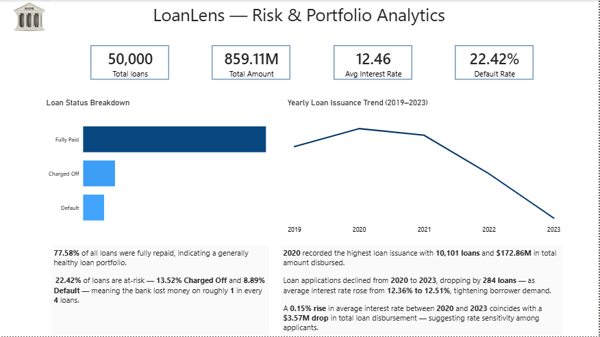
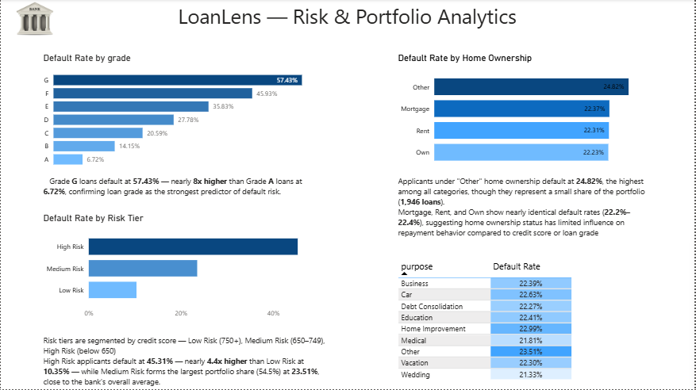

# 🏦 LoanLens — Bank Loan Risk & Portfolio Analytics

An end-to-end data analytics project analyzing 50,000 bank loan records to uncover default risk drivers, evaluate portfolio health, and deliver actionable recommendations for credit risk management — built using **PostgreSQL, SQL, and Power BI**.

---

## 📌 Project Overview

Banks lose significant revenue when loans default or are charged off. This project analyzes a loan portfolio to answer a core business question:

> **"Which applicants are most likely to default, and what should the bank do about it?"**

The analysis covers loan performance, risk segmentation by grade and credit score, applicant profiling (DTI, employment length), and home ownership patterns — culminating in a 3-page interactive Power BI dashboard.

---

## 🛠️ Tools & Tech Stack

| Tool | Purpose |
|---|---|
| **Python** | Synthetic dataset generation, data structuring |
| **PostgreSQL** | Database hosting, SQL-based business analysis |
| **SQL** | 15+ business queries — aggregation, window functions, CTEs |
| **Power BI** | Interactive 3-page dashboard, DAX measures |
| **DAX** | Custom measures (Default Rate, Risk Tier, formatted labels) |

---

## 🗂️ Dataset

A realistic synthetic dataset of **50,000 loan records** with 20 attributes, including:

`loan_id`, `issue_date`, `loan_status`, `loan_amount`, `term`, `interest_rate`, `grade`, `purpose`, `home_ownership`, `annual_income`, `employment_length`, `dti`, `credit_score`, `number_of_open_accounts`, `bankruptcies`, `tax_liens`, and more.

**Loan Status Distribution:**
| Status | Count | % |
|---|---|---|
| Fully Paid | 38,792 | 77.58% |
| Charged Off | 6,761 | 13.52% |
| Default | 4,447 | 8.89% |

---

## 🔍 SQL Analysis

15 business-driven SQL queries were written to extract insights, organized by complexity:

**Basic**
- Total loans, total amount disbursed, average interest rate
- Loan status breakdown and overall default rate
- Average loan amount by purpose
- Loan distribution by term

**Intermediate**
- Default rate by loan grade
- Default rate by home ownership
- Average DTI for defaulters vs. non-defaulters
- Default rate by employment length
- Top loan purposes by default rate

**Advanced**
- Risk segmentation (Low / Medium / High) using `CASE WHEN`
- Running monthly cumulative loan amount using `SUM() OVER()`
- Ranking loan grades by default rate using `RANK()`
- Year-over-year default rate trend

📁 Full query file: [`sql/analysis.sql`](sql/analysis.sql)

---

## 🧠 Advanced Query Highlights

A few standout queries that go beyond basic aggregation:

**1. Risk-Adjusted Net Revenue by Grade**
Estimates interest earned vs. principal lost per grade to surface which segments are actually profitable.
```sql
WITH grade_summary AS (
    SELECT 
        grade,
        SUM(CASE WHEN loan_status = 'Fully Paid' THEN loan_amount * interest_rate/100 ELSE 0 END) AS interest_earned,
        SUM(CASE WHEN loan_status IN ('Default','Charged Off') THEN loan_amount ELSE 0 END) AS principal_lost
    FROM loan_data
    GROUP BY grade
)
SELECT 
    grade,
    ROUND(interest_earned,2) AS interest_earned,
    ROUND(principal_lost,2) AS principal_lost,
    ROUND(interest_earned - principal_lost,2) AS net_revenue
FROM grade_summary
ORDER BY net_revenue ASC;
```

**2. Income Quartile Default Analysis (NTILE)**
Splits applicants into 4 income quartiles to test whether income level predicts default risk.
```sql
WITH income_quartile AS (
    SELECT 
        loan_id, loan_status, annual_income,
        NTILE(4) OVER (ORDER BY annual_income) AS income_quartile
    FROM loan_data
)
SELECT 
    income_quartile,
    COUNT(*) AS total_loans,
    ROUND(SUM(CASE WHEN loan_status IN ('Default','Charged Off') THEN 1 ELSE 0 END)*100.0/COUNT(*),2) AS default_pct
FROM income_quartile
GROUP BY income_quartile
ORDER BY income_quartile;
```

**3. Grade Default Rate vs. Portfolio Benchmark**
Compares each grade's default rate against the overall portfolio average using a `CROSS JOIN`.
```sql
WITH grade_default AS (
    SELECT grade,
           ROUND(SUM(CASE WHEN loan_status IN ('Default','Charged Off') THEN 1 ELSE 0 END)*100.0/COUNT(*),2) AS default_pct
    FROM loan_data
    GROUP BY grade
),
overall_avg AS (
    SELECT ROUND(SUM(CASE WHEN loan_status IN ('Default','Charged Off') THEN 1 ELSE 0 END)*100.0/COUNT(*),2) AS avg_default
    FROM loan_data
)
SELECT 
    g.grade, g.default_pct, o.avg_default,
    ROUND(g.default_pct - o.avg_default,2) AS gap_vs_avg
FROM grade_default g
CROSS JOIN overall_avg o
ORDER BY gap_vs_avg DESC;
```

**4. Cumulative Default Rate Over Time**
Tracks running default rate month over month to detect whether portfolio risk is worsening.
```sql
WITH monthly AS (
    SELECT 
        TO_CHAR(issue_date,'YYYY-MM') AS month,
        COUNT(*) AS total_loans,
        SUM(CASE WHEN loan_status IN ('Default','Charged Off') THEN 1 ELSE 0 END) AS bad_loans
    FROM loan_data
    GROUP BY TO_CHAR(issue_date,'YYYY-MM')
)
SELECT 
    month, total_loans, bad_loans,
    ROUND(
        SUM(bad_loans) OVER (ORDER BY month) * 100.0 / 
        SUM(total_loans) OVER (ORDER BY month), 
    2) AS cumulative_default_pct
FROM monthly
ORDER BY month;
```

---

## 📊 Dashboard Overview

### Page 1 — Loan Overview


KPI summary (Total Loans, Total Amount, Avg Interest Rate, Default Rate), loan status breakdown, and yearly loan issuance trend.

**Key Insight:** 2020 recorded the highest loan issuance (10,101 loans, $172.86M). Issuance declined through 2023 alongside a 0.15% rise in average interest rate — suggesting rate sensitivity among borrowers.

### Page 2 — Risk Analysis


Default rate by loan grade, home ownership, credit-score-based risk tier, and loan purpose.

**Key Insight:** Grade G loans default at 57.43% — nearly 8x higher than Grade A (6.72%), confirming loan grade as the strongest default predictor. High Risk applicants (credit score <650) default at 45.31%, 4.4x higher than Low Risk applicants (10.35%).

### Page 3 — Applicant Profile


Default rate by employment length and average DTI by loan status.

**Key Insight:** Employment length shows minimal predictive power (21.45%–23.49% range). DTI, however, is a strong signal — defaulted/charged-off loans carry ~19.9% average DTI vs. 16.54% for fully paid loans, a 3.3-point gap.

---

## 💡 Key Findings

1. **Loan grade and credit score are the strongest predictors of default** — far more reliable than demographic or employment factors.
2. **DTI is a meaningful early-warning signal** — borrowers with higher existing debt burdens are more likely to default.
3. **Employment tenure has almost no correlation with default risk**, challenging a common underwriting assumption.
4. **Home ownership has limited risk differentiation** (~22% across Mortgage, Rent, Own) — not a strong standalone risk factor.
5. **Nearly 1 in 4 loans (22.42%) result in losses** for the bank, representing significant portfolio risk concentrated in low-grade, high-DTI borrowers.

---

## ✅ Recommendations — Risk Mitigation Strategy

Based on the analysis, here are actionable measures the bank can take to reduce default losses:

### 1. Tighten Underwriting for High-Risk Segments
- Apply stricter approval thresholds for **Grade E, F, G** applicants and those with **credit scores below 650**.
- Consider requiring **collateral, co-signers, or smaller loan amounts** for these segments instead of outright rejection — balances risk reduction with revenue retention.

### 2. Use DTI as a Hard Cutoff, Not Just a Factor
- Flag applicants with **DTI above 25–30%** for manual underwriting review.
- Introduce a **maximum DTI cap** (e.g., 35%) for loan approval, since defaulted loans average ~20% DTI vs. 16.5% for healthy loans.

### 3. Re-price Risk Through Interest Rates
- Since Grade G/F applicants default at 45–57%, ensure interest rates charged adequately compensate for that risk (risk-based pricing) — protects overall portfolio profitability even if some loans default.

### 4. Reduce Reliance on Weak Predictors
- De-prioritize **employment length** as an underwriting factor given its near-flat default correlation (21–23% range) — freeing up underwriting focus for stronger signals like credit score and DTI.

### 5. Proactive Monitoring for Medium Risk Tier
- Medium Risk applicants form **54.5% of the portfolio** — the largest segment. Implement **early-warning monitoring** (e.g., payment delay alerts) for this group specifically, since a small shift in their behavior has outsized portfolio impact.

### 6. Targeted Collections Strategy
- Since "Charged Off" loans (13.52%) represent fully written-off losses, invest in **earlier intervention before charge-off** — restructuring or settlement offers at the "Default" stage (8.89%) could recover value before it's lost entirely.

### 7. Re-evaluate the "Other" Home Ownership Segment
- This group defaults highest (24.82%) but is a small sample (1,946 loans) — monitor for now rather than over-correcting policy based on limited data.

---

## 📁 Project Structure

```
bank-loan-risk-analysis/
│
├── dataset/
│   └── bank_loan_data.csv
├── sql/
│   ├── schema.sql
│   └── analysis.sql
├── dashboard/
│   └── LoanLens_Dashboard.pbix
├── screenshots/
│   ├── page1_loan_overview.png
│   ├── page2_risk_analysis.png
│   └── page3_applicant_profile.png
└── README.md
```

---

## 🚀 How to Use

1. Clone this repository
2. Import `bank_loan_data.csv` into PostgreSQL using `schema.sql`
3. Run queries in `sql/analysis.sql` to reproduce the analysis
4. Open `LoanLens_Dashboard.pbix` in Power BI Desktop to explore the interactive dashboard

---

## 👤 Author

**Anas**
Data Analyst | SQL • Power BI • Python
🔗 [GitHub](https://github.com/Akhan33-10) | [LinkedIn](#)

---

⭐ If you found this project useful, consider giving it a star on GitHub!
